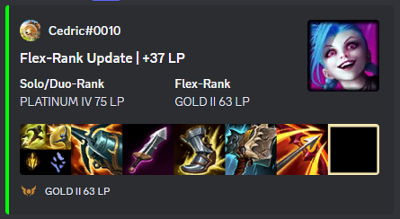

# Discord Bot for League of Legends
Created by [@Hack2C](https://github.com/Hack2C) and [@ZeterickS](https://github.com/ZeterickS) (And Copilot)

## Description
We described it on: [RankedSentinel.com](https://rankedsentinel.com/)

This is a Discord Bot, written in Golang. You can register yourself with the /add command. 
It will notify you and your friends, when a LOL-Ranked Match is started.
It will also notify you when the Ranked Match is finished and give you a brief overview of your or your friends build.
Its funny to see 5 Loses in a Row :D

## Usage

1. Add the Bot to your Server [via Link](https://discord.com/oauth2/authorize?client_id=1325815580929822742&scope=bot)
2. Use the /add command to register your LOL Account

    

3. The Bot will notify your Channel, when a Ranked game:

    3.1 Starts:

    

    3.2 Ends:

    

## Motivation

Our motivation for this project was to learn Go, and it is our first time using it. So we are aware much of it is pretty shitty. Copilot has helped us alot with syntax.
This project is a Discord bot written in Go that interacts with the Riot Games API to provide information about active games and summoner updates. It uses the `discordgo` library to interact with Discord and `github.com/bwmarrin/discordgo` for Discord API interactions.
We use Postgres for storaging.

## Project Structure

- **Main Application**: Contains the main application logic.
- **API Helper**: Functions to interact with external APIs.
- **Discord Bot**: Integration with Discord for sending messages and notifications.
- **Database Helper**: Functions to save and load data.
- **CI/CD**: Continuous Integration and Deployment setup using GitHub Actions and a helper script.

## TODO

- **Testing**: Since this was our first ever Golang Project, we didnt realy care about testing. This would need to be corrected.
- **Benchmarking**: Our Container, deployed on Kubernetes needs about 13MiB & 0.002 CPU for 2 Channels and ~10 registered Users, which receive updates. Further Benchmarking would be needed
- **Scaling**: Since we dont know our Benchmarks, it could be important to scale the application. It does not support this right now. More then one Instance would lead to DB conflicts and rate limits.

## Getting Started

### Prerequisites

- Go 1.23.4 or higher
- Docker (for CI/CD)
- GitHub CLI (for managing GitHub repositories)

### Installation

#### Docker

1. Ensure you have Docker and Docker Compose installed on your machine.
2. Create a [`.env`](.env) file in the root directory of the project and add your Riot Games API key, Discord bot token, and other necessary environment variables, or set the Variables through the docker-compose.yml:
    ```env
    DISCORD_BOT_TOKEN="your-discord-bot-token"
    RIOT_API_TOKEN="your-riot-api-key"
    CHANNEL_ID="your-discord-channel-id"
    GUILD_ID="your-discord-guild-id"
    API_RATE_LIMIT_2_MINUTE=100
    API_RATE_LIMIT_SECOND=20
    DEVELOPMENT=False
    GITHUB_TOKEN="your-github-token"
    GITHUB_USERNAME="your-github-username"
    POSTGRES_USER="your_postgres_user"
    POSTGRES_PASSWORD="your_postgres_password"
    POSTGRES_DB="your_postgres_db"
    POSTGRES_HOST="your_postgres_host"
    LOCAL_BUILD=False
    DEBUG=False
    LOG_LEVEL=INFO
    ```

3. Run the following command to start the bot using Docker Compose:
    ```sh
    docker-compose -f /deployments/docker-compose/docker-compose.yaml --env-file .env up -d
    ```

This will pull the Docker image, set up the necessary environment variables, and start the bot in a detached mode.

#### Manual

1. Create a [.env](http://_vscodecontentref_/2) file in the root directory of the project and add your Riot Games API key and Discord bot token:
    ```env
    DISCORD_BOT_TOKEN="your-discord-bot-token"
    RIOT_API_TOKEN="your-riot-api-key"
    CHANNEL_ID="your-discord-channel-id"
    GUILD_ID="your-discord-guild-id"
    API_RATE_LIMIT_2_MINUTE=100
    API_RATE_LIMIT_SECOND=20
    DEVELOPMENT=False
    POSTGRES_USER="your_postgres_user"
    POSTGRES_PASSWORD="your_postgres_password"
    POSTGRES_DB="your_postgres_db"
    POSTGRES_HOST="your_postgres_host"
    GITHUB_TOKEN="your-github-token"
    GITHUB_USERNAME="your-github-username"
    LOCAL_BUILD=False
    DEBUG=False
    LOG_LEVEL=INFO
    ```

2. To run the bot, use the following command:
    ```sh
    go run main.go
    ```
